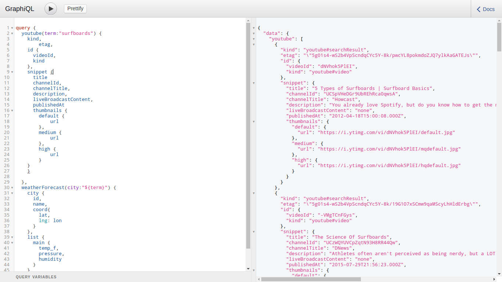
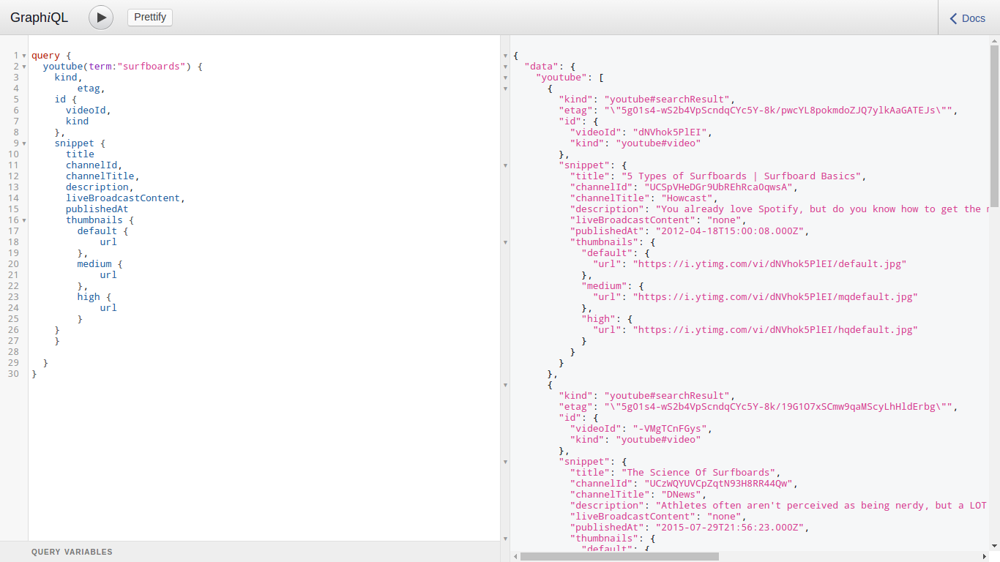

# GraphQL Server for Open Weather Map API and YOuTube app

###Added Youtube search API to the GraphQL server

This is a GraphQL server for the OpenWeatherMap API for the 5 Day / 3 hour forecast.

 

The app accessing the GraphQL server is created with no surprise - React with Redux.
GraphQL server is accesing API END points and from redux action request is being made to GraphQL server 
```
use lested verion of node v5.x use nvm :)
npm install
npm run start
open localhost:8888
open localhost:8888/graphql

```


## IMPORTANT
Application Setup
its accessing openweather API and Youtube API so just add them in keys dir 
```
const API_KEYS = {
  youtube: "YOUR YOUTUBE KEY HERE",
  weather: "YOUR OPEN WEATHERMAP KEY HERE"
};

export default API_KEYS;

```

To use GraphiQL, open your browser and go to http://localhost:8888/graphql

Review the Docs in the upper right hand corner to view more about the fields available.

Below is a query to get query all the available fields in the current setup.  The "city" parameter is required and you can change it to whatever city you want.  NOTE: for this setup, the default country it searches for is the USA.





```
query {
  weatherForecast(city:"Seattle") {
    city {
      id,
      population,
      name,
      country,
      coord{
        lon,
        lat
      }
    },
    cnt,
    message,
    list{
      dt,
      dt_txt
      main{
        temp,
        temp_min,
        temp_max,
        pressure,
        sea_level,
        grnd_level,
        humidity,
        temp_kf,
        temp_f,
        temp_c
      },
      weather{
        id,
        main,
        description,
        icon
      },
      wind{
        speed,
        deg
      },
      clouds{
        all
      }
    }

  }
}


```
Now another query fetch data from both rest API together

```
{
   weatherForecast(city:"${term}") {
          city {
            id,
            name,
            coord{
              lat,
              lng: lon
            }
          },
          pressure_data,
          humidity_data,
          temp_f_data,
          temp_f_avg,
          pressure_avg,
          humidity_avg,
        }
      },
      youtube(term:"${term}") {
        kind,
        etag,
        id {
          videoId,
          kind
        },
        snippet {
          title
          channelId,
          channelTitle,
          description,
          liveBroadcastContent,
          publishedAt
          thumbnails {
            default {
              url
            },
            medium {
              url
            },
            high {
              url
            }
          }
        }
      }
```

```
**UPDATE**.  I have added more fields to the GraphQL schema to make the react components do less work.  I added fields that only bring in the array data for the fields I need and calculates the averages for me.  I no longer need to map over an array of objects to get the data I need or calculate the averages for the charts.  I just pass in data and it is used as-is.  The components are dumber and that is a good thing.

```
query: `
{
  weatherForecast(city:"${term}") {
    city {
      id,
      name,
      coord{
        lat,
        lng: lon
      }
    },
    pressure_data,
    humidity_data,
    temp_f_data,
    temp_f_avg,
    pressure_avg,
    humidity_avg,
  }
}
`
```

Here is a sample of all the available fields for the youtube search API.

```
query {
  youtube(term:"surfboards") {
    kind,
		etag,
    id {
      videoId,
      kind
    },
    snippet {
      title
      channelId,
      channelTitle,
      description,
      liveBroadcastContent,
      publishedAt
      thumbnails {
      	default {
        	url
      	},
      	medium {
        	url
      	},
      	high {
        	url
      	}
    }
    }

  }
}
# the sample app I plan will not require half of those fields, maybe just 4-5 of them!
```
Contact
====================
[](http://gennexttraining.herokuapp.com/)
[](https://github.com/tkssharma)
[](mailto:tarun.softengg@gmail.com)
[](https://www.linkedin.com/in/tkssharma)
[](https://twitter.com/tkssharma)